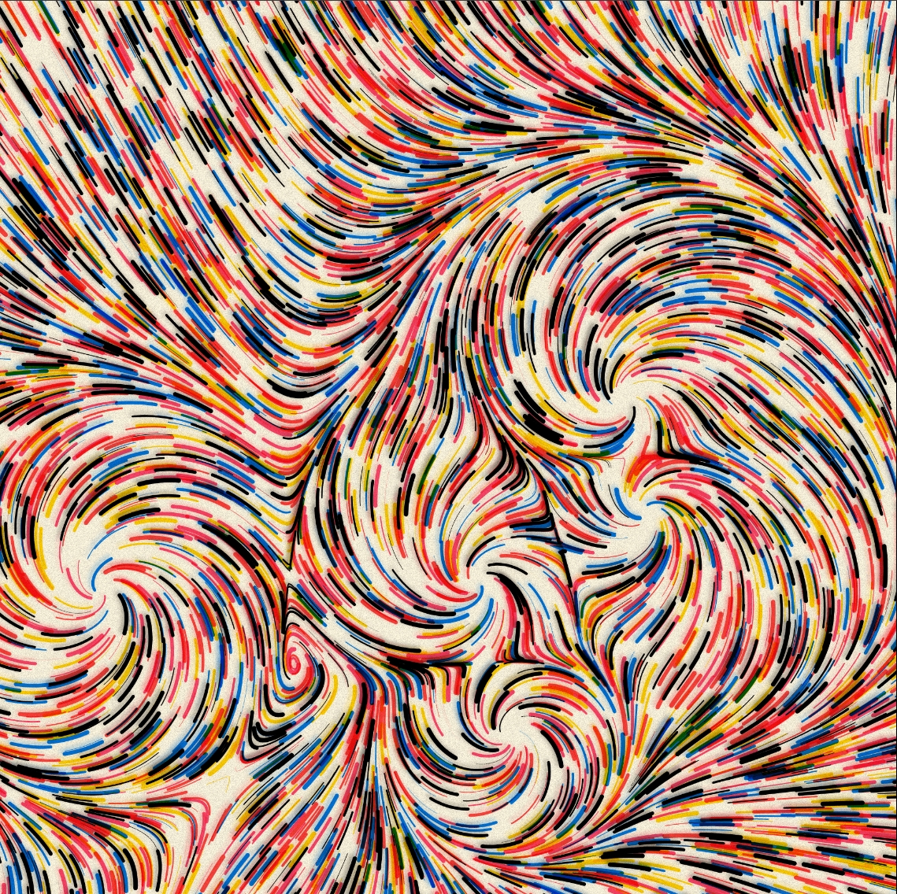
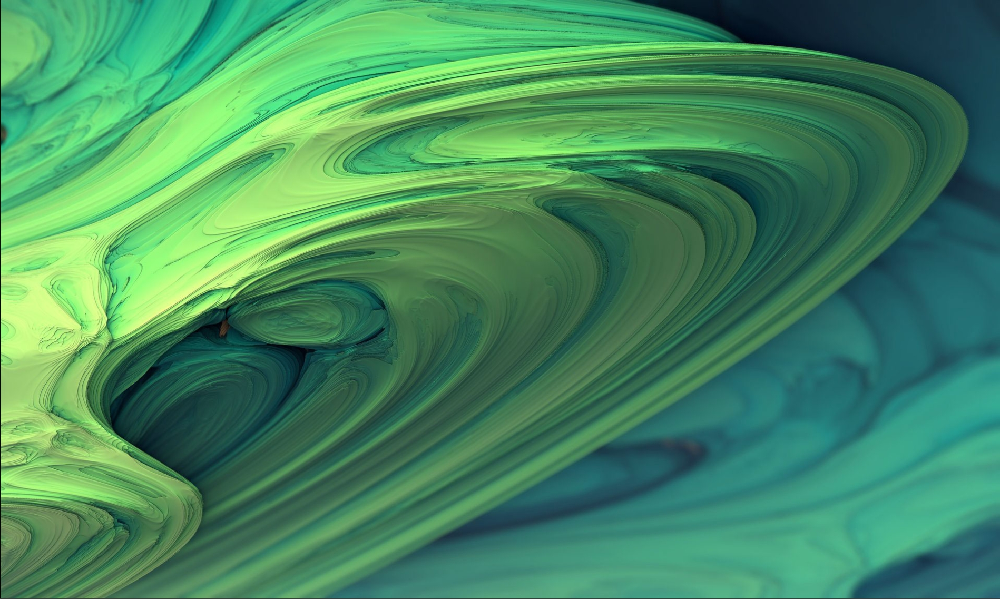
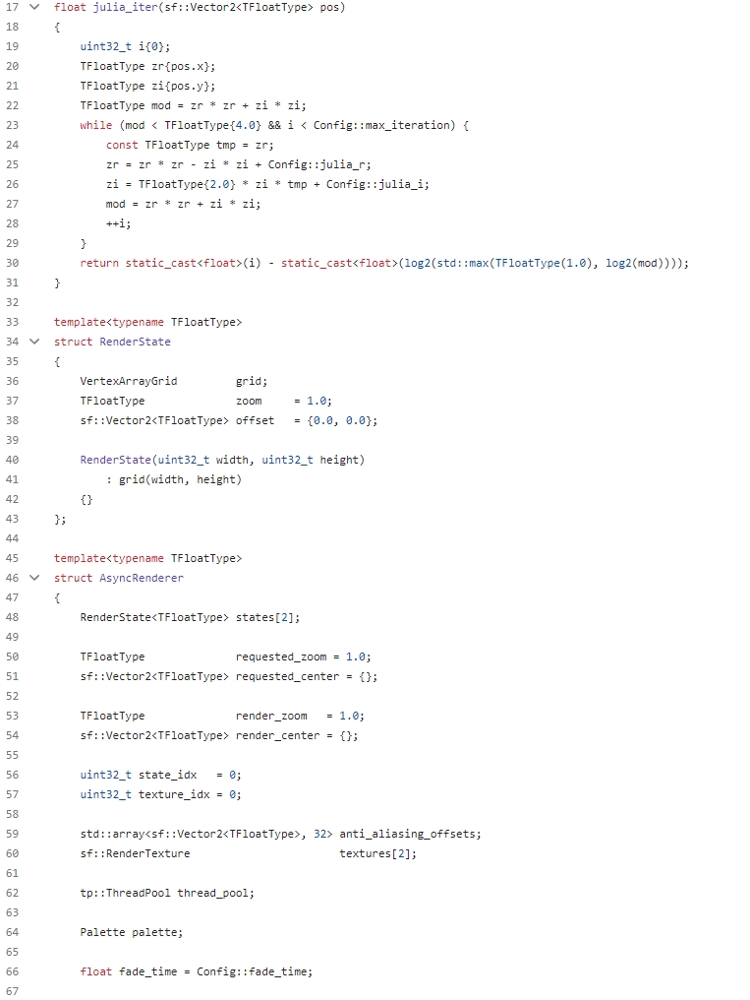

##  Imaging Technique Inspiration
For the drawing of Edvard Munch's "The Scream", I chose Fractal Art as my inspiration. Fractal art is the use of mathematical algorithms and iterative processes to create complex and self-similar images. I thought this technique would be useful for the representation of The Scream as it helped me to create a nice distorted effect.  

It has three features：  
**1. Self-similarity**
A partial enlargement of it is similar to its whole.  
**2. Infinitely Fine**
There is still fine structure at arbitrarily small scales. As the image is enlarged, instead of losing details, you will see finer and finer details.  
**3. Extremely irregular**
It is not a simple geometric figure, is complex and irregular.  

## Coding Technique Exploration
For the implementation of fractal art I found the case of an implementation using C++ and SFML which utilises a kind of recursion where the complex C determines the shape of the image, the project defines a Julia set which is a fractal.
The function `julia_iter()` generates a kind of iteration which counts the number of iterations. So in my project it might be possible to use this recursion to design shapes. `getStateScale()` and `getStateOffset()` functions compute the scale and offset of a given state, respectively. The user can control the movement and scaling of the fractal from the keyboard.
Project Link: [JuliaRendering](https://github.com/johnBuffer/JuliaRendering/tree/main/src "JuliaRendering")
Code Screenshot：

